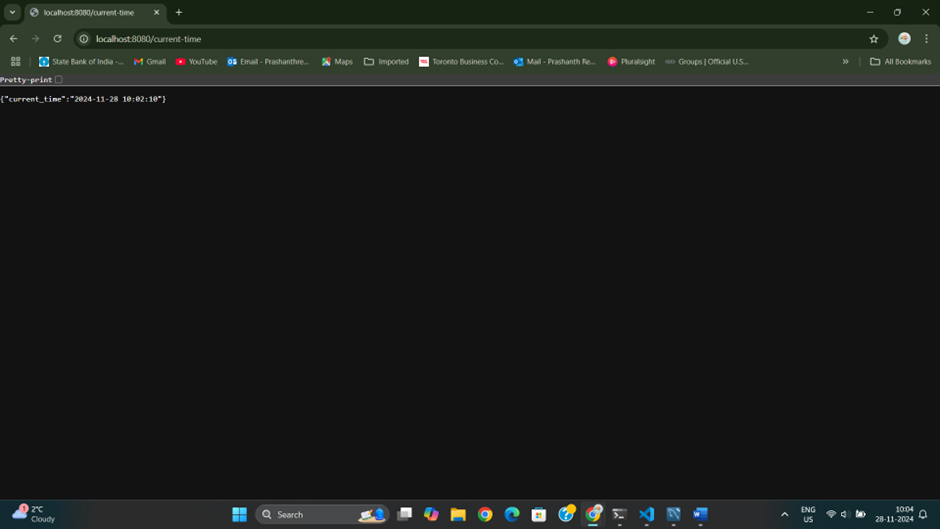
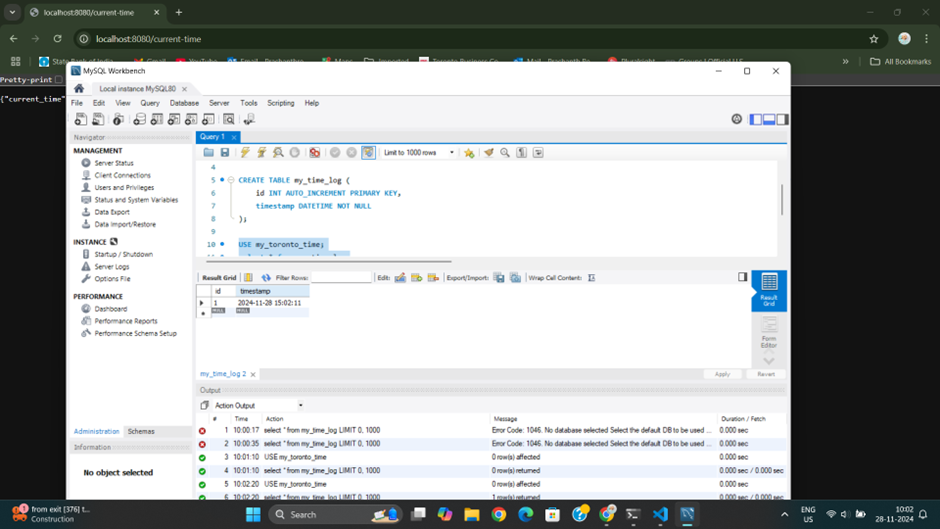
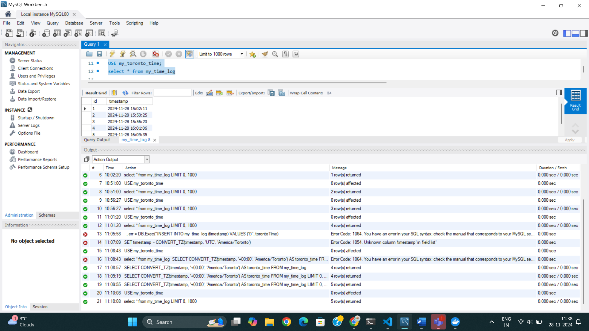

# Toronto Time API with MySQL Database

This is a simple Go-based API that provides the current time in Toronto (converted from UTC), logs the time into a MySQL database.
## Features

- **Current Time in Toronto**: The `/current-time` endpoint returns the current time in Toronto.
- **Log Retrieval**: The `/logs` endpoint retrieves all logged times stored in the database.

---

## Project Setup

### Prerequisites

- **Go**: Version 1.20 or higher installed on your machine.
- **Docker**: Docker and Docker Compose must be installed to run the application in containers.
- **MySQL**: The project uses MySQL to store the logged times.

**The timestamp is displayed in JSON format in the browser and can also be seen in the database after querying.**

